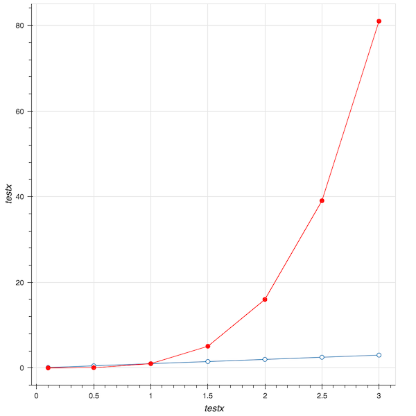
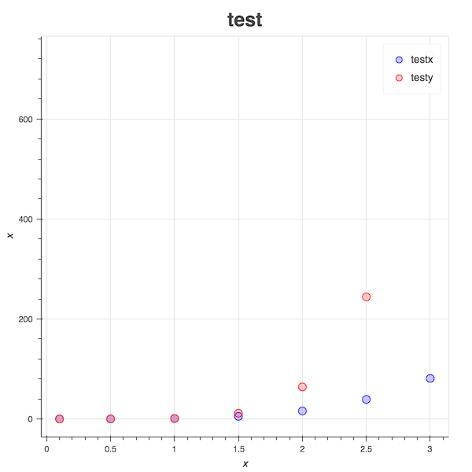

# ML_Toolbox

## Visualization
From [bokeh](https://bokeh.pydata.org)

## Example

### Visualization

```python
import vis as v
x = [0.1, 0.5, 1.0, 1.5, 2.0, 2.5, 3.0]
y  = [i**4 for i in x]

chart = v.Line(x,y)
chart.x_label = "testx"
chart.y_label = "testy"
chart.show()
```

{:height="50%" width="50%"}

```python
x1 = list(range(150))
y1 = [i**2 for i in x]
x2 = list(range(150))
y2 = [i**1.5 for i in x]

chart = v.Dot(x,y,x,[i**1.5 for i in y])
chart.label1 = "testx"
chart.label2 = "testy"
chart.title = "test"
chart.show()
```
{:height="50%" width="50%"}
